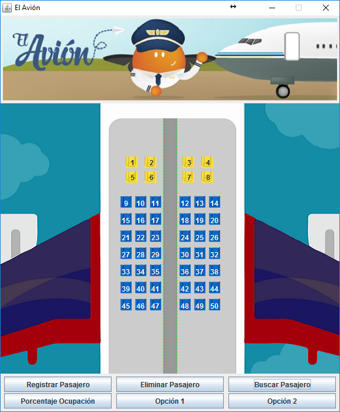

# Enunciado
Se quiere crear un programa que tenga como objetivo el manejo de reservas de un avión. Este avión cuenta con un número
fijo de 50 sillas. De ellas, 8 son de clase ejecutiva, mientras que el resto son de clase económica. Cada silla puede 
ser asignada a un pasajero que cuenta con un nombre y una cédula. Este último dato es la entrada principal para poder 
consultar una reserva o eliminarla del sistema.

Cuando se asigna una silla es necesario conocer las preferencias del usuario. Este puede elegir la posición de la silla,
ventana, pasillo o centro, y la clase, ejecutiva o económica. En el caso especial de las sillas ejecutivas, solo es
posible elegir las posiciones: ventana o pasillo. Las sillas son asignadas de forma secuencial según su ubicación y su
clase. De igual forma, el programa permite buscar la reserva de un pasajero y visualizar los datos de la reserva.

El programa debe permitir al usuario:

1. Asignar una silla a un pasajero
2. Eliminar reserva
3. Buscar pasajero
4. Calcular el porcentaje de ocupación del avión.

# Interfaz
